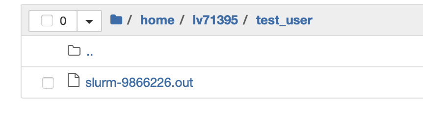
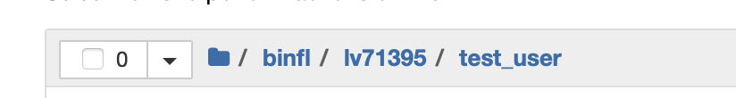

## Table of contents  
1. [About this Repository](#About-this-Repository)
2. [Instructions to use the Jupyterhub on the VSC](#Instructions-to-use-the-Jupyterhub-on-the-VSC)
3. [scRNAseq start notebooks](#scRNAseq-start-notebooks)

## About this Repository  
This repository gives detailed instructions on how to use Jupyterhub on the [Vienna scientific cluster](https://vsc.ac.at/home/) with main focus on R applications. There are also two jupyternotebooks to get you started with your scRNAseq analysis.  
<br/><br/>
## Instructions to use the Jupyterhub on the VSC  
__step 1:__  if you affliated with the [Department of Dermatology](https://www.meduniwien.ac.at/web/en/about-us/organisation/university-departments/department-of-dermatology/?L=3) of the Medical University of Vienna and you want to use Jupyterhub via the VSC please do contact me: matthias.wielscher@meduniwien.ac.at. I will need your username and a cellphone number preferentially registered at an Austrian moblie network provider.  
__step 2:__ I will create a user on the VSC for you and we will have a brief meeting/call with a technical introduction and I will give an overview of code of conduct for using the VSC resources. Additionally, I strongly recomend attending [introductory classes](https://vsc.ac.at/research/vsc-research-center/vsc-school-seminar/) provided by the VSC team.   
__step 3:__ To start a Jupyternotebook go to here [https://vsc.ac.at/jupyterhub/hub/spawn](https://vsc.ac.at/jupyterhub/hub/spawn). You will be asked for your username a password, which will be provided by me. Then you will be asked to perform a 2-factor authentification with the cell phone number you provided in step1.  
__step 4:__ select VSC singularity image, then pick R notebook incase you want to use R. Basic/Data scienece/etc. notebooks are for python programming. You should look at screen that looks similar to that:  

<p align="center">
  
</p>  

__step 4:__ Select your server specifications: run time, RAM memory, CPU (please keep in mind that most processes in R are serial)  
__step 5:__ set your working directory:  once your server spawns you will get access to your to your home directory on the VSC. The default path looks like so:  
<p align="left">
  
</p>  
It would be good if you work on the dedicated bioinformatic file storage system. For this you have to hit the folder button and change the path until it looks like so:
<p align="left">
  
</p>  

Now you can start upload and analyse your data! If you are working with bulkRNAseq data you can check out [this repository](https://github.com/Mwielscher/RNAseq) for additional help.  
  
  - - -  
  
__step 6 How to manage your R-packages:__  
The easiest way to manage your R-packages is to install them to a dedicated folder for example you could create a folder called "R_libs". Then you can instruct R to install your packages there and load the packages from the dedicated folder:  
__CRAN-packages:__  
```install.packages("devtools",lib="/binfl/lv71395/test_user/R_libs") ```  
For some packages it is necessary to also laod dependencies. For example "devtools" needs "usethis" to be loaded  
```lapply(c("usethis","devtools"), library,lib.loc = "/binfl/lv71395/test_user/R_libs", character.only = TRUE)```  
keep an eye on the order: load usethis before devtools.  
now you can __install from github__ like so:  
```install_github("satijalab/seurat", ref = "release/4.0.0",lib="/binfl/lv71395/test_user/R_libs")```    
__Bioconductor-packages:__  
First install BiocManager and load:  
```install.packages("BiocManager",lib="/binfl/lv71395/test_user/R_libs")```  
```library(BiocManager, lib.loc = "/binfl/lv71395/test_user/R_libs")```  
Then install:  
```BiocManager::install("DESeq2",lib="/binfl/lv71395/test_user/R_libs")```
<br/><br/>
Load multiple packages at once  
```my.libs=c("devtools","usethis","BiocManager","Seurat","DESeq2")```  
```lapply(my.libs, library,lib.loc = "/binfl/lv71395/test_user/R_libs", character.only = TRUE)```  
- - -  

<br/><br/>
  

## scRNAseq start notebooks  
These are Jupyternotebooks for scRNAseq analysis. Comments and more detailed explainations are in the notebooks.  
>* this [notebook](singleSAMPLE_scRNAseq.ipynb) takes output from [10xcell ranger](https://support.10xgenomics.com/single-cell-gene-expression/software/pipelines/latest/output/overview) and performs an initial exploratory analysis of the reads incl. doublet score calculation. Then it runs the Seurat SCT pipeline. The notebook als contains scirpt cells for differential gene expresssion analysis. It compares each cell population (cluster) against each remaining cluster (cell population) in the analysis. Resulting lists can be exported or can be further analysed with enrichR to gather information about possible cell type identities. Finally, cluster specfic markers are TIERed so you can see the top markers associtated to each cluster.
>* this [notebook](integrate_multiple10x_samples.ipynb) merges and integrates several 10x scRNAseq datasests together and then performs the same differential gene expression analysis as outlined above.  
